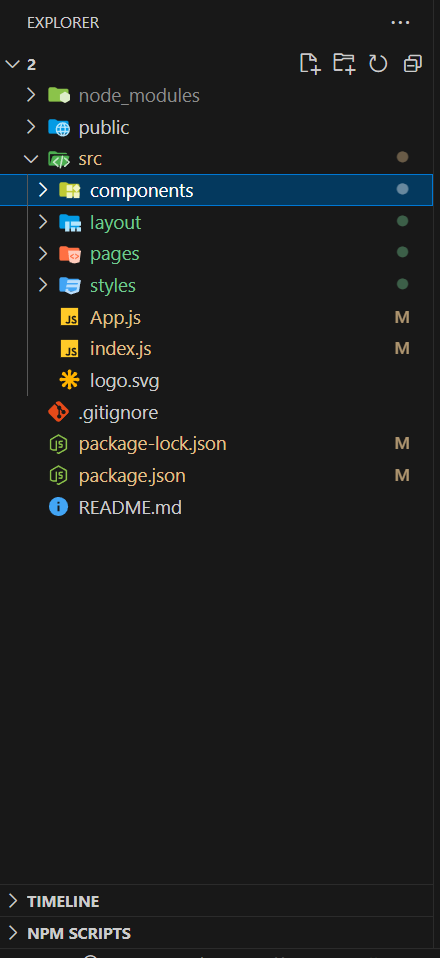
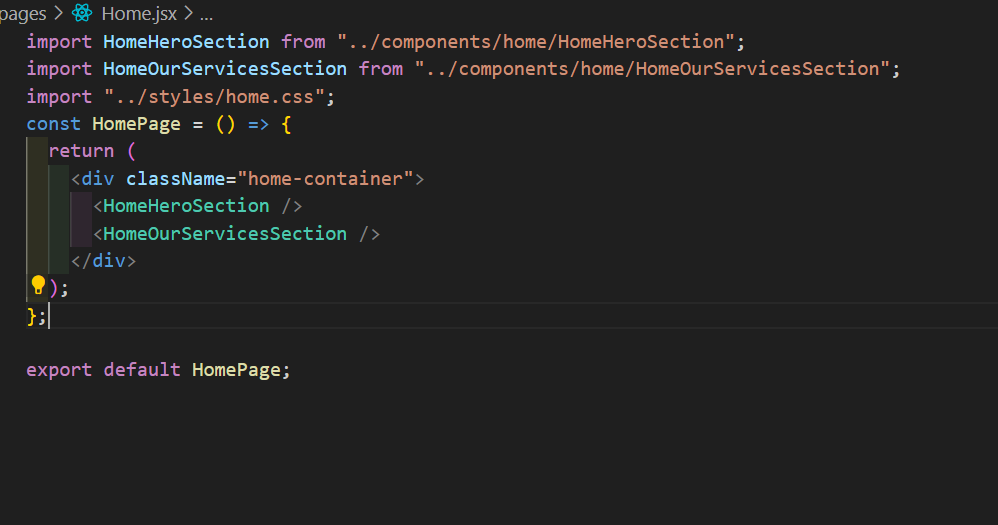
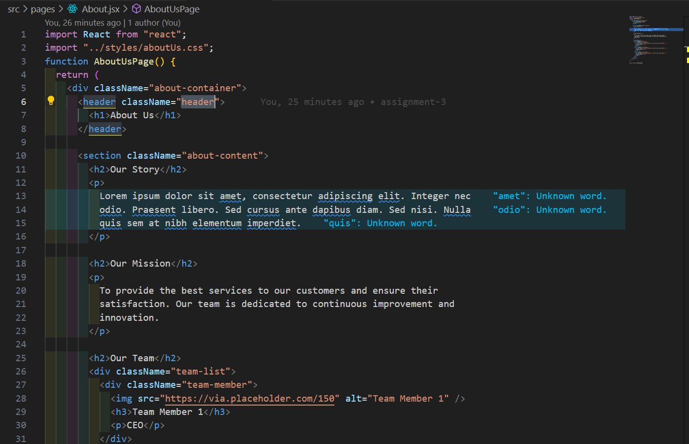

In this assignment, we created a simple ReactJS frontend application that demonstrates the use of react-router-dom for routing between three different pages: Home, About Us, and Contact Us. The project structure is organized to include separate CSS files for each page, ensuring modular and maintainable code. The application uses HashRouter for routing to meet the requirement for Elvis.

Steps to Build the Application:

Step 1: Setting Up the Project

Create a New React App: npx create-react-app my-assignment-3

cd my-assignment-3

Step 2: Install React Router

npm install react-router-dom

Step 3: Project Structure:

Project Folder Structure
Root Directory
node_modules: Contains all npm packages.
public: Holds static assets like index.html.
src: Main source code directory.
src Directory
components: Reusable React components.

layout: Layout components defining overall structure (e.g., header, footer).

pages: Main pages of the application (e.g., Home, About Us, Contact Us).

styles: CSS files for styling the application.

App.js: Main React component that sets up the application and routing.

index.js: Entry point for the React application, rendering App.

logo.svg: Static logo asset.

.gitignore: Specifies files to ignore in version control.

package-lock.json and package.json: Manage project dependencies.

README.md: Project documentation.

Step 4: Create Page

1: Home Page

Home Page Overview
The home page of your React application includes three main sections:

Hero Section: Captures user attention with a bold welcome message and a call-to-action button.

Services Section: Displays key services in a visually appealing card layout.

Footer: Provides essential company information and remains fixed at the bottom.
The clean and structured layout ensures a positive user experience.

Which I have created using component named HeroSection & OurServiceSection

2: About Us Page

The About Us page of your React application is designed to provide detailed information about the company, its mission, and its team. The page includes the following sections:

Header Section: Features a prominent "About Us" heading to introduce the page.

Our Story Section: Contains a brief history of the company presented in placeholder text.

Our Mission Section: Highlights the company's commitment to providing excellent services and fostering continuous improvement and innovation.

The well-structured layout of the About Us page ensures that visitors can easily learn about the company and its values.

3: Contact Us Page

Contact Us Page Overview
The Contact Us page of your React application is designed to facilitate communication between the company and its visitors. The page includes the following sections:

Header Section: Features a prominent "Contact Us" heading to introduce the page.

Contact Information Section: Provides essential contact details such as the company's address, phone number, and email address.

Contact Form Section: Includes a user-friendly contact form where visitors can send their inquiries directly to the company. The form typically contains fields for the visitor's name, email address, subject, and message.

The Contact Us page's clear and accessible layout ensures that visitors can easily reach out to the company with their questions or feedback.

